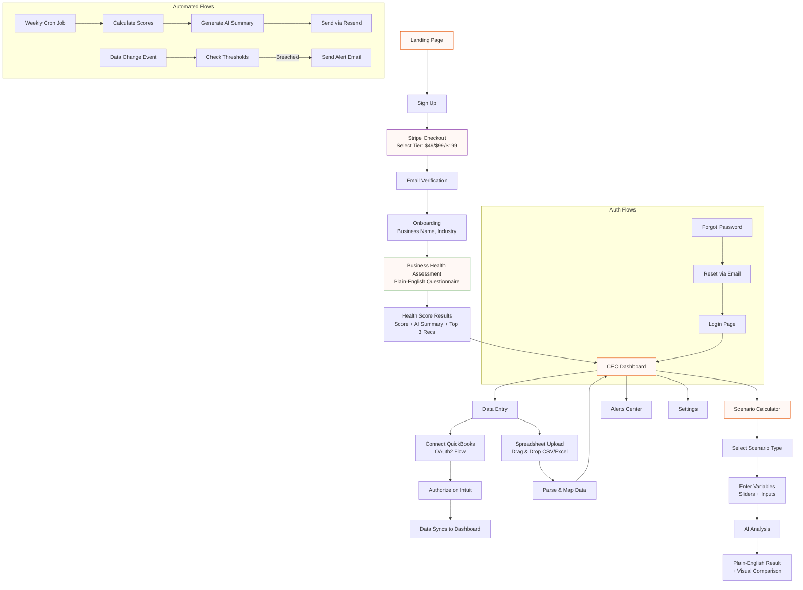

# PRD: ProfitPulse MVP

## Introduction

ProfitPulse is a CEO dashboard for service-based business owners who need clear, actionable visibility into their financial health without the complexity of traditional accounting software or the $2,500-$5,000/month cost of a fractional CFO. It layers on top of existing tools (QuickBooks, spreadsheets) to provide real-time insights, cash flow visibility, and plain-English explanations that help first-generation entrepreneurs make confident decisions.

The platform transforms scattered financial data into a simple, visual dashboard with traffic-light health indicators, AI-powered plain-English insights, and an interactive Scenario Calculator (the hero feature) that turns numbers into decisions.

**Client:** Joyce Hayward / Fusion 4 Business
**Built by:** Apps Built With AI
**Version:** 1.0 MVP (February 2026)

---

## Goals

- Give service-based business owners a single dashboard showing their financial health at a glance
- Replace confusion with clarity: every metric explained in plain English, no accounting jargon
- Provide a Business Health Score (1-100) with transparent formula so users understand exactly how it's calculated
- Enable what-if scenario planning (the hero feature) so owners can make confident decisions about hiring, pricing, and growth
- Support two data input methods: spreadsheet upload (CSV/Excel drag-and-drop) and QuickBooks Online sync
- Generate automated weekly email summaries and threshold-based alerts
- Monetize via Stripe subscription billing at three tiers ($49/$99/$199 per month, no free trial)
- Serve as a funnel to Joyce's high-ticket advisory services ($2,500-$5,000/month VIP)

---

## User Flow Diagram

---

## User Stories

Each story is sized to be completable in a single AI agent context window. Stories are ordered by dependency (earlier stories must complete before later ones can use their output). Ralph runs with up to 20 loops per story.

---

### PHASE 1: Foundation (No credentials needed)

---

### US-001: Project Scaffolding & Tailwind Config
**Description:** As a developer, I need the Next.js project scaffolded with Tailwind CSS configured to the ProfitPulse design system tokens.

**Acceptance Criteria:**
- [ ] Next.js 14 app created with TypeScript, Tailwind CSS, App Router
- [ ] InsForge SDK (`@insforge/sdk`) installed
- [ ] Tailwind config includes custom colors: orange `#E65100`, background `#FFF8F5`, surface `#FFFFFF`, text-primary `#2D2A26`, text-secondary `#6B6560`, text-muted `#9A948E`, accent `#7B1FA2`, success `#43A047`, warning `#F9A825`, error `#D32F2F`
- [ ] Tailwind config includes font families: `display` (Georgia, serif), `body` (Arial, sans-serif)
- [ ] Tailwind config includes spacing scale: xs/8px, sm/16px, md/24px, lg/32px, xl/48px, 2xl/64px
- [ ] Tailwind config includes border radius: sm/6px, md/10px, lg/16px, full/50%
- [ ] Global CSS sets background `#FFF8F5`, body font Arial, base font size 14px
- [ ] Git repo initialized, `develop` branch created
- [ ] `npm run build` passes with no errors

**Priority:** 1
**Blocked by:** Nothing

---

### US-002: Core UI Components (Buttons, Inputs, Cards)
**Description:** As a developer, I need reusable UI components matching the approved design system so all pages are visually consistent.

**Acceptance Criteria:**
- [ ] `Button` component with variants: primary (filled `#E65100`, white text, rounded), secondary (outlined `#E65100`, orange text), cancel (gray background, dark text)
- [ ] `Input` component with states: default (light bg `#FFFFFF`, gray border), focused (orange `#E65100` border), error (red `#D32F2F` border, red helper text)
- [ ] `Card` component with variants: standard (white bg, subtle shadow), featured (orange `#E65100` border), highlight (cream `#FFF8F5` bg)
- [ ] All components use Arial for text labels, generous padding, soft corners (border-radius md/10px)
- [ ] Components exported from a shared `@/components/ui` directory
- [ ] `npm run build` passes
- [ ] Verify in browser using dev-browser skill

**Priority:** 2
**Blocked by:** US-001

---

### US-003: Health Score Gauge & Status Components
**Description:** As a developer, I need the health score gauge and traffic-light status components that are unique to ProfitPulse's visual language.

**Acceptance Criteria:**
- [ ] `HealthScoreGauge` component: dark circle background, colored ring (green `#43A047` for 80-100, amber `#F9A825` for 50-79, red `#D32F2F` for 0-49), score number centered in white Georgia font
- [ ] Gauge accepts `score` prop (0-100) and renders appropriate color
- [ ] `TrafficLightDot` component: small colored circle (green/amber/red) with optional label text
- [ ] `StatusBadge` component: pill-shaped badge with text ("Healthy"/"Attention"/"Critical") in corresponding color
- [ ] `ProgressBar` component: orange `#E65100` fill, gray track, accepts `value` and `max` props
- [ ] Green/amber/red colors used ONLY on these status components, never on buttons or headers
- [ ] `npm run build` passes
- [ ] Verify in browser using dev-browser skill

**Priority:** 3
**Blocked by:** US-001

---

### US-004: Landing Page
**Description:** As a visitor, I want to see a warm, approachable landing page that explains ProfitPulse and motivates me to sign up.

**Acceptance Criteria:**
- [ ] Public page at `/` (no auth required)
- [ ] Hero section: headline "Finally understand your numbers—without the accounting degree" in Georgia font, subheadline in Arial, primary CTA "Get Started" button
- [ ] Benefits section: 3-4 cards highlighting Health Score, Plain-English Insights, Scenario Calculator, Alerts
- [ ] Pricing section: three tier cards (Starter $49, Growth $99, Scale $199) with feature lists, each with "Get Started" CTA
- [ ] Footer with basic links
- [ ] Warm color palette: orange CTAs, off-white `#FFF8F5` background, no cold/corporate feel
- [ ] Mobile responsive (cards stack vertically on small screens)
- [ ] `npm run build` passes
- [ ] Verify in browser using dev-browser skill

**Priority:** 4
**Blocked by:** US-002

---

### PHASE 2: Auth & Database (Needs InsForge credentials)

---

### US-005: Database Schema & Row Level Security
**Description:** As a developer, I need the InsForge database tables and RLS policies created so all app data is stored securely.

**Acceptance Criteria:**
- [ ] Tables created in InsForge:
  - `profiles`: user_id (FK), business_name, industry, employee_count, created_at
  - `subscriptions`: user_id (FK), stripe_customer_id, stripe_subscription_id, tier, status, current_period_end
  - `health_assessments`: user_id (FK), cash_on_hand, monthly_revenue, monthly_expenses, accounts_receivable, health_score, ai_summary, recommendations (JSON), created_at
  - `financial_data`: user_id (FK), period_date, cash_balance, revenue, expenses, receivables, data_source (manual/spreadsheet/quickbooks), created_at
  - `expense_categories`: financial_data_id (FK), category, amount
  - `alert_configs`: user_id (FK), cash_threshold, expense_increase_pct, runway_threshold_months, alerts_enabled booleans, notification_email
  - `alert_history`: user_id (FK), alert_type, message, triggered_at, read (boolean)
  - `scenarios`: user_id (FK), scenario_type, inputs (JSON), result (JSON), ai_explanation, created_at
  - `quickbooks_connections`: user_id (FK), tokens (encrypted), realm_id, token_expires_at, last_sync_at
- [ ] Row Level Security policies: users can only read/write their own rows on ALL tables
- [ ] `npm run build` passes

**Priority:** 5
**Blocked by:** US-001
**Credentials needed:** InsForge Project URL + API Key

---

### US-006: Auth Pages - Sign Up & Login
**Description:** As a user, I want to create an account and log in so I can access my dashboard.

**Acceptance Criteria:**
- [ ] Sign Up page at `/signup`: email, password, business name, industry dropdown
- [ ] Industry dropdown options: Engineering, Medical Services, Dental, Construction, Churches, Schools, Other
- [ ] Welcoming copy: "Let's get you some clarity" messaging
- [ ] Login page at `/login`: email + password fields
- [ ] "Forgot password?" link on login page (navigates to `/forgot-password`)
- [ ] Auth handled via InsForge Auth SDK (`insforge.auth.signUp`, `insforge.auth.signIn`)
- [ ] After successful signup: create profile row in `profiles` table, redirect to `/checkout`
- [ ] After successful login: redirect to `/dashboard`
- [ ] Form validation with error states matching design system (red border, red text)
- [ ] Mobile responsive
- [ ] `npm run build` passes
- [ ] Verify in browser using dev-browser skill

**Priority:** 6
**Blocked by:** US-002, US-005
**Credentials needed:** InsForge Project URL + API Key

---

### US-007: Auth - Password Reset & Email Verification
**Description:** As a user, I want to reset my password and verify my email so my account stays secure.

**Acceptance Criteria:**
- [ ] Forgot Password page at `/forgot-password`: email input, "Send Reset Link" button
- [ ] Reset Password page at `/reset-password`: new password + confirm password fields
- [ ] Password reset handled via InsForge Auth SDK
- [ ] Email verification flow: after signup, user receives verification email via InsForge
- [ ] If user tries to access app without verified email, show "Check your email" message
- [ ] Success/error toast messages for all auth actions
- [ ] Mobile responsive
- [ ] `npm run build` passes
- [ ] Verify in browser using dev-browser skill

**Priority:** 7
**Blocked by:** US-006
**Credentials needed:** InsForge Project URL + API Key

---

### US-008: Stripe Checkout & Tier Selection
**Description:** As a new user, I want to select a subscription tier and pay so I can access the platform.

**Acceptance Criteria:**
- [ ] Tier selection page at `/checkout` (shown after signup)
- [ ] Three tier cards: Starter ($49/mo), Growth ($99/mo), Scale ($199/mo) with feature lists
- [ ] Selecting a tier creates Stripe Checkout Session via API route (`/api/stripe/checkout`)
- [ ] User redirected to Stripe Checkout for payment
- [ ] On success: redirect to `/onboarding`, subscription record created in `subscriptions` table
- [ ] On cancel: return to tier selection page
- [ ] Stripe products and prices created (can be hardcoded IDs or created via API)
- [ ] `npm run build` passes
- [ ] Verify in browser using dev-browser skill

**Priority:** 8
**Blocked by:** US-006
**Credentials needed:** Stripe Publishable Key + Secret Key

---

### US-009: Stripe Webhooks & Subscription Management
**Description:** As a developer, I need Stripe webhooks to keep subscription status in sync and a way for users to manage billing.

**Acceptance Criteria:**
- [ ] Webhook endpoint at `/api/stripe/webhooks` handles: `checkout.session.completed`, `customer.subscription.updated`, `customer.subscription.deleted`, `invoice.payment_failed`
- [ ] Webhook verifies Stripe signature
- [ ] On `checkout.session.completed`: update `subscriptions` table with tier, status, stripe IDs
- [ ] On subscription change/cancel: update `subscriptions` table accordingly
- [ ] Utility function `getUserTier(userId)` that returns current tier or null
- [ ] Stripe Customer Portal session creation at `/api/stripe/portal` for billing management
- [ ] `npm run build` passes

**Priority:** 9
**Blocked by:** US-008
**Credentials needed:** Stripe Secret Key + Webhook Secret

---

### US-010: Authenticated App Layout & Navigation
**Description:** As a logged-in user, I want a consistent navigation layout so I can move between dashboard sections easily.

**Acceptance Criteria:**
- [ ] App layout wrapper for all authenticated pages
- [ ] Top navigation bar: "Dashboard" | "Scenarios" | "Data" | "Settings" links
- [ ] Active nav item highlighted with orange `#E65100` underline
- [ ] User avatar/initial circle in top-right corner with dropdown (Profile, Billing, Logout)
- [ ] Mobile: hamburger menu that slides out with same nav items
- [ ] Auth guard: unauthenticated users redirected to `/login`
- [ ] Subscription guard: users without active subscription redirected to `/checkout`
- [ ] `npm run build` passes
- [ ] Verify in browser using dev-browser skill

**Priority:** 10
**Blocked by:** US-006, US-009

---

### PHASE 3: Core Experience

---

### US-011: Health Assessment - Questionnaire UI
**Description:** As a new user, I want to answer simple questions about my business so ProfitPulse can assess my financial health.

**Acceptance Criteria:**
- [ ] Assessment page at `/assessment` (shown after onboarding for first-time users)
- [ ] Welcome message: "Let's get you some clarity on your business."
- [ ] Step-by-step form (one question per step) with progress indicator
- [ ] Questions in plain English:
  - "How much cash do you have in the bank right now?" (currency input)
  - "What were your total sales last month?" (currency input)
  - "What were your total expenses last month?" (currency input)
  - "How much money are clients/customers currently owing you?" (currency input)
  - "How many employees do you have?" (number input)
  - "What's your biggest financial worry right now?" (textarea)
- [ ] "Next" and "Back" navigation between steps
- [ ] Currency inputs formatted with $ and commas
- [ ] Form data stored in local state until final submission
- [ ] On submit: save to `health_assessments` table in InsForge
- [ ] Mobile responsive
- [ ] `npm run build` passes
- [ ] Verify in browser using dev-browser skill

**Priority:** 11
**Blocked by:** US-010

---

### US-012: Health Assessment - Score Calculation & Results
**Description:** As a user who completed the assessment, I want to see my health score with a clear explanation of how it was calculated.

**Acceptance Criteria:**
- [ ] Results page at `/assessment/results` (shown after questionnaire submission)
- [ ] Health Score calculated:
  - Cash Runway (40%): (cash_on_hand / monthly_expenses) normalized to 0-100 (6+ months = 100)
  - Profit Margin (30%): ((revenue - expenses) / revenue) * 100, capped at 100
  - Receivables Health (30%): lower ratio of receivables to revenue = healthier, normalized 0-100
- [ ] Score displayed using `HealthScoreGauge` component (dark circle, colored ring, centered number)
- [ ] `StatusBadge` below gauge: "Healthy" / "Attention" / "Critical"
- [ ] Formula breakdown section: "Here's how we calculated your score:" with each component shown
- [ ] Score saved to `health_assessments` table
- [ ] "Continue to Dashboard" button at bottom
- [ ] Mobile responsive
- [ ] `npm run build` passes
- [ ] Verify in browser using dev-browser skill

**Priority:** 12
**Blocked by:** US-011

---

### US-013: Health Assessment - AI Summary & Recommendations
**Description:** As a user, I want AI-generated plain-English insights about my assessment results so I understand what the numbers mean.

**Acceptance Criteria:**
- [ ] AI summary paragraph displayed on results page below the score
- [ ] Generated via InsForge AI Gateway (GPT-4o Mini)
- [ ] Prompt includes: cash on hand, revenue, expenses, receivables, employee count, user's biggest worry
- [ ] Output: 2-3 sentences in conversational tone explaining what the score means, no jargon
- [ ] Top 3 actionable recommendations displayed as numbered cards
- [ ] Recommendations are specific and actionable (e.g., "Build a cash reserve of 3 months expenses" not "Improve cash flow")
- [ ] AI summary and recommendations saved to `health_assessments` table
- [ ] Loading state while AI generates (skeleton text)
- [ ] Graceful fallback if AI is unavailable (show score without AI text)
- [ ] `npm run build` passes
- [ ] Verify in browser using dev-browser skill

**Priority:** 13
**Blocked by:** US-012
**Credentials needed:** InsForge Project URL + API Key (for AI gateway)

---

### US-014: Dashboard - Layout, Greeting & Health Score Card
**Description:** As a business owner, I want to see my dashboard with a personal greeting and my health score prominently displayed.

**Acceptance Criteria:**
- [ ] Dashboard page at `/dashboard` (default page after login)
- [ ] Greeting section: "Good morning, [First Name]" (or afternoon/evening based on time) with current date in format "Monday, February 11, 2026"
- [ ] Health Score card (featured card with orange border):
  - `HealthScoreGauge` showing current score
  - `StatusBadge`: "Healthy" / "Attention" / "Critical"
  - Change delta: "+5 from last week" (compare to previous data entry)
- [ ] Score pulled from most recent `health_assessments` row or recalculated from latest `financial_data`
- [ ] If no data yet: show "Complete your assessment" prompt linking to `/assessment`
- [ ] Mobile responsive
- [ ] `npm run build` passes
- [ ] Verify in browser using dev-browser skill

**Priority:** 14
**Blocked by:** US-012

---

### US-015: Dashboard - Metric Cards & Cash Position
**Description:** As a business owner, I want to see my profit, cash flow, runway, and cash position at a glance with traffic-light indicators.

**Acceptance Criteria:**
- [ ] Three metric cards in a row below health score:
  - **Profit**: dollar amount (revenue - expenses), status text ("On Track"/"Declining"/"Loss"), `TrafficLightDot` (green if positive, amber if declining, red if loss)
  - **Cash Flow**: dollar amount (money in - money out), status text, `TrafficLightDot`
  - **Runway**: months remaining (cash / monthly expenses), status text, `TrafficLightDot` (green >3mo, amber 1-3mo, red <1mo)
- [ ] Dollar amounts displayed in Georgia font, labels in Arial
- [ ] Cash Position section below metric cards:
  - Large dollar amount showing current cash on hand in Georgia font
  - "Money In" with amount and down-arrow icon
  - "Money Out" with amount and up-arrow icon
- [ ] AI Insight card at bottom: lightbulb icon + plain-English sentence (placeholder text for now, real AI in US-021)
- [ ] Quick action button: "Run a Scenario" linking to `/scenarios`
- [ ] All data sourced from latest `financial_data` row in InsForge
- [ ] Cards stack vertically on mobile
- [ ] `npm run build` passes
- [ ] Verify in browser using dev-browser skill

**Priority:** 15
**Blocked by:** US-014

---

### US-016: Data Entry - Manual Forms
**Description:** As a business owner, I want to enter my financial data through simple forms so the dashboard reflects my real numbers.

**Acceptance Criteria:**
- [ ] Data Entry page at `/data` (accessible from top nav "Data")
- [ ] Two tabs or sections: "Enter Manually" and "Upload Spreadsheet" (upload built in US-017)
- [ ] Manual entry form with plain-English labels:
  - "Cash in the bank right now" (currency input with $ prefix)
  - "Total sales this month" (currency input)
  - "Total expenses this month" (currency input)
  - "Money customers owe you" (currency input)
  - Optional expandable section: expense breakdown (rent, payroll, supplies, marketing, other)
- [ ] Period selector: month/year picker for which period this data covers
- [ ] "Save" button stores data in `financial_data` table with `data_source: 'manual'`
- [ ] After saving: success toast, dashboard metrics auto-recalculate
- [ ] History list below form showing previous entries with dates
- [ ] "Or connect QuickBooks" link (placeholder for US-025)
- [ ] Mobile responsive
- [ ] `npm run build` passes
- [ ] Verify in browser using dev-browser skill

**Priority:** 16
**Blocked by:** US-015

---

### US-017: Data Entry - Spreadsheet Upload & Parsing
**Description:** As a business owner, I want to drag-and-drop my financial spreadsheet so I don't have to type everything manually.

**Acceptance Criteria:**
- [ ] Drag-and-drop zone on Data Entry page: "Drop your financial spreadsheet here" with file picker fallback
- [ ] Accepted file types: CSV (.csv) only
- [ ] File size limit: 10MB with error message if exceeded
- [ ] CSV parsing via Papa Parse library
- [ ] After upload: show preview table of parsed data (first 10 rows)
- [ ] Column mapping UI: dropdowns to map spreadsheet columns to fields (Revenue, Expenses, Cash Balance, Date)
- [ ] Smart auto-detection: try to guess column mapping from header names
- [ ] "Import" button to confirm and save mapped data to `financial_data` table with `data_source: 'spreadsheet'`
- [ ] Success/error states after import
- [ ] `npm run build` passes
- [ ] Verify in browser using dev-browser skill

**Priority:** 17
**Blocked by:** US-016

---

### PHASE 4: Scenario Calculator (Hero Feature)

---

### US-018: Scenario Calculator - Page Layout & Type Cards
**Description:** As a business owner, I want to see the available scenario types so I can choose what financial question to explore.

**Acceptance Criteria:**
- [ ] Scenario Calculator page at `/scenarios` (accessible from top nav "Scenarios")
- [ ] "What-If Calculator" header in Georgia font with back arrow to dashboard
- [ ] Four scenario type cards in a 2x2 grid:
  - **Break-Even**: target icon, "Calculate when you'll break even", subtitle "Find your break-even point"
  - **Goal Planning**: flag icon, "Plan to reach your revenue goal", subtitle "Map your path to target"
  - **Can I Hire?**: person icon, "See if you can afford a new hire", subtitle "Check hiring readiness"
  - **Cash Runway**: hourglass icon, "Check how long your cash will last", subtitle "Plan for the future"
- [ ] Clicking a card navigates to `/scenarios/[type]`
- [ ] Saved scenarios list below cards (empty state: "No saved scenarios yet")
- [ ] Mobile responsive (cards stack 1 column on small screens)
- [ ] `npm run build` passes
- [ ] Verify in browser using dev-browser skill

**Priority:** 18
**Blocked by:** US-015

---

### US-019: Scenario - Break-Even Calculator
**Description:** As a business owner, I want to calculate my break-even point so I know how many sales I need to cover my expenses.

**Acceptance Criteria:**
- [ ] Page at `/scenarios/break-even`
- [ ] Input form:
  - "Monthly fixed expenses" (currency input, auto-filled from financial data if available)
  - "Average price per service/product" (currency input)
  - "Variable cost per service/product" (currency input)
- [ ] Calculate button triggers: break-even units = fixed expenses / (price - variable cost)
- [ ] Result displayed in plain English: "You need to sell [X] [services/products] per month to break even"
- [ ] Visual chart: horizontal bar showing current sales vs break-even threshold
- [ ] AI explanation via InsForge AI Gateway (GPT-4o Mini): 1-2 sentences contextualizing the result
- [ ] Traffic-light badge: green if current sales > break-even, amber if close, red if below
- [ ] "Save Scenario" and "Try Different Numbers" buttons
- [ ] Save stores to `scenarios` table
- [ ] `npm run build` passes
- [ ] Verify in browser using dev-browser skill

**Priority:** 19
**Blocked by:** US-018

---

### US-020: Scenario - Goal Planning Calculator
**Description:** As a business owner, I want to plan how to reach my revenue goal so I know what my monthly targets need to be.

**Acceptance Criteria:**
- [ ] Page at `/scenarios/goal-planning`
- [ ] Input form:
  - "Annual revenue goal" (currency input)
  - "Current monthly revenue" (currency input, auto-filled from financial data if available)
  - "Months remaining in the year" (number input or auto-calculated)
- [ ] Calculate: required monthly revenue = (annual goal - revenue so far) / months remaining
- [ ] Result in plain English: "To hit $[X] by year-end, you need $[Y]/month for the next [Z] months"
- [ ] Visual: progress bar showing current progress toward goal
- [ ] AI explanation (GPT-4o Mini): contextualizes whether the goal is achievable
- [ ] Traffic-light badge: green/amber/red based on feasibility
- [ ] "Save Scenario" and "Try Different Numbers" buttons
- [ ] `npm run build` passes
- [ ] Verify in browser using dev-browser skill

**Priority:** 20
**Blocked by:** US-018

---

### US-021: Scenario - Hiring Readiness Calculator
**Description:** As a business owner, I want to know if I can afford to hire someone so I can grow my team with confidence.

**Acceptance Criteria:**
- [ ] Page at `/scenarios/hiring` (this is the mockup reference scenario)
- [ ] Input form matching design mockup:
  - "Annual salary" (currency input, e.g., $45,000)
  - "Benefits & overhead" (auto-calculated at 25% of salary, shown as read-only, e.g., $11,250)
  - "When do you want to hire?" (slider: "Now" to "12 months", with label showing selected value like "3 months from now")
- [ ] Calculate: new monthly cost = (salary + benefits) / 12; new profit = current profit - new monthly cost
- [ ] Result in plain English: "Yes, you can afford to hire!" or "Not yet—here's what needs to change"
- [ ] `StatusBadge`: green "Achievable" or red "Not Yet"
- [ ] Profit Comparison bar chart: "Current Monthly Profit" bar vs "After Hiring" bar
- [ ] AI explanation (Claude Sonnet 4.5 or GPT-4o via InsForge for nuanced analysis)
- [ ] "Save Scenario" and "Try Different Numbers" buttons
- [ ] `npm run build` passes
- [ ] Verify in browser using dev-browser skill

**Priority:** 21
**Blocked by:** US-018

---

### US-022: Scenario - Cash Runway & Shortfall Recovery
**Description:** As a business owner, I want to check how long my cash will last and plan for recovery if I miss a target.

**Acceptance Criteria:**
- [ ] Cash Runway page at `/scenarios/runway`:
  - Input: "Current cash on hand" (auto-filled), "Monthly burn rate" (auto-filled from expenses)
  - Result: "You can operate for [X] months at current spending"
  - Visual: timeline bar showing months of runway
  - Traffic-light badge based on months (green >6, amber 3-6, red <3)
- [ ] Shortfall Recovery section below (or separate tab):
  - Input: "How much did you miss your target by?" (currency), "Months to recover" (number)
  - Result: "To make up the shortfall, you need an extra $[X]/month"
  - Alternative suggestions from AI
- [ ] AI explanations for both scenarios
- [ ] "Save Scenario" and "Try Different Numbers" buttons for each
- [ ] `npm run build` passes
- [ ] Verify in browser using dev-browser skill

**Priority:** 22
**Blocked by:** US-018

---

### PHASE 5: Intelligence & Alerts

---

### US-023: AI Insights Engine
**Description:** As a developer, I need a centralized AI insights service that generates plain-English explanations for the dashboard, assessment, and scenarios.

**Acceptance Criteria:**
- [ ] Service/utility at `@/lib/ai-insights.ts` with functions:
  - `generateDashboardInsight(financialData)` → 1-2 sentence dashboard insight
  - `generateAssessmentSummary(assessmentData)` → 2-3 sentence assessment summary + 3 recommendations
  - `generateScenarioExplanation(scenarioType, inputs, result)` → 1-2 sentence scenario context
- [ ] All functions use InsForge AI Gateway (`insforge.ai.chat()`)
- [ ] GPT-4o Mini for dashboard insights and assessment (cost-effective)
- [ ] Claude Sonnet 4.5 or GPT-4o for scenario explanations (more nuanced)
- [ ] System prompts enforce: plain English, no jargon, conversational tone, actionable
- [ ] Response caching: cache AI responses for 1 hour (keyed by input hash)
- [ ] Error handling: return null if AI unavailable, UI shows data without AI text
- [ ] Dashboard AI Insight card now uses real AI (replace placeholder from US-015)
- [ ] `npm run build` passes

**Priority:** 23
**Blocked by:** US-015, US-013

---

### US-024: Alert Configuration & Threshold Settings
**Description:** As a business owner, I want to set alert thresholds and notification preferences so I'm warned before problems become crises.

**Acceptance Criteria:**
- [ ] Alerts Center page at `/alerts`
- [ ] Threshold configuration form:
  - "Alert me when cash drops below $____" (currency input)
  - "Alert me when expenses increase more than ___% in a month" (percentage input)
  - "Alert me when cash runway drops below ___ months" (number input)
- [ ] Toggle switches for each alert type: Cash alerts, Expense alerts, Weekly summary
- [ ] Notification email field (defaults to account email)
- [ ] Save configuration to `alert_configs` table
- [ ] Alert history list below config showing past alerts (from `alert_history` table)
- [ ] Empty state for history: "No alerts yet. We'll notify you when something needs attention."
- [ ] Mobile responsive
- [ ] `npm run build` passes
- [ ] Verify in browser using dev-browser skill

**Priority:** 24
**Blocked by:** US-015

---

### US-025: Alert Email Sending & Threshold Checking
**Description:** As a system, I need to check financial data against alert thresholds and send email notifications when breached.

**Acceptance Criteria:**
- [ ] Server-side function (InsForge Edge Function or Next.js API route) that:
  - Accepts a user ID and checks their latest financial data against their `alert_configs`
  - If cash < threshold: trigger cash alert
  - If expenses increased > threshold %: trigger expense alert
  - If runway < threshold months: trigger runway alert
- [ ] Alert email sent via Resend with:
  - ProfitPulse branding (orange header, warm design)
  - Plain-English explanation of what triggered the alert
  - CTA button: "View Your Dashboard"
- [ ] Alert recorded in `alert_history` table
- [ ] Function called whenever `financial_data` is updated (after manual entry, spreadsheet upload, or QuickBooks sync)
- [ ] Duplicate prevention: don't send same alert type within 24 hours
- [ ] `npm run build` passes

**Priority:** 25
**Blocked by:** US-024
**Credentials needed:** Resend API Key

---

### US-026: Weekly Email Summary
**Description:** As a business owner, I want to receive a weekly email with my health score and top insights so I stay informed.

**Acceptance Criteria:**
- [ ] Email template with ProfitPulse branding:
  - Greeting: "Good morning, [Name]!"
  - Health Score: "Your ProfitPulse score this week: [X]/100"
  - Score trend: "Up/Down [N] points from last week"
  - Top 2-3 AI-generated insights in plain English
  - CTA button: "View Your Dashboard" linking to app
  - Unsubscribe link in footer
- [ ] Sent via Resend
- [ ] Scheduled via Vercel Cron Job (every Monday at 8am) or InsForge Edge Function
- [ ] Only sent to users with `weekly_summary_enabled: true` in `alert_configs`
- [ ] AI insights generated per user using `generateDashboardInsight()`
- [ ] `npm run build` passes

**Priority:** 26
**Blocked by:** US-023, US-025
**Credentials needed:** Resend API Key

---

### PHASE 6: Integrations & Polish

---

### US-027: QuickBooks OAuth Flow & Connection
**Description:** As a business owner, I want to connect my QuickBooks account so my financial data syncs automatically.

**Acceptance Criteria:**
- [ ] "Connect QuickBooks" button on Data Entry page and Settings page
- [ ] OAuth2 initiation: API route `/api/quickbooks/auth` generates Intuit authorization URL
- [ ] Callback handler at `/api/quickbooks/callback` exchanges code for tokens
- [ ] Tokens stored encrypted in `quickbooks_connections` table
- [ ] Connection status shown: "Connected to QuickBooks" with company name or "Not Connected"
- [ ] "Disconnect" button removes tokens
- [ ] Feature-gated: only available for Growth ($99) and Scale ($199) tiers
- [ ] If user is on Starter tier: show upgrade prompt instead of connect button
- [ ] `npm run build` passes
- [ ] Verify in browser using dev-browser skill

**Priority:** 27
**Blocked by:** US-016
**Credentials needed:** Intuit Developer Account (Client ID, Client Secret)

---

### US-028: QuickBooks Data Sync
**Description:** As a connected QuickBooks user, I want my financial data to sync automatically so my dashboard always reflects real numbers.

**Acceptance Criteria:**
- [ ] Sync function pulls from QuickBooks API:
  - Cash on hand (from bank account balances)
  - Monthly revenue (from P&L report income section)
  - Monthly expenses (from P&L report expense section)
  - Accounts receivable balance
  - Expense category breakdown
- [ ] Initial sync: pull last 12 months of monthly data
- [ ] Data saved to `financial_data` table with `data_source: 'quickbooks'`
- [ ] "Sync Now" button triggers on-demand refresh
- [ ] "Last synced: [time]" indicator
- [ ] Automatic daily sync via scheduled function
- [ ] Token refresh handling (QuickBooks tokens expire after 1 hour, refresh tokens after 100 days)
- [ ] Error handling: if sync fails, show error message and suggest reconnecting
- [ ] Dashboard and health score recalculate after sync
- [ ] `npm run build` passes

**Priority:** 28
**Blocked by:** US-027
**Credentials needed:** Intuit Developer Account

---

### US-029: Subscription Tier Feature Gating
**Description:** As the product owner, I want features gated by tier so users are incentivized to upgrade.

**Acceptance Criteria:**
- [ ] Utility function `checkFeatureAccess(userId, feature)` returns boolean
- [ ] Feature access rules:
  - **Starter ($49):** Dashboard, manual data entry, spreadsheet upload, weekly email, health score, break-even scenario only, max 3 saved scenarios
  - **Growth ($99):** Everything in Starter + all 5 scenario types, email alerts, AI insights, QuickBooks integration
  - **Scale ($199):** Everything in Growth (placeholder for v1.1 features)
- [ ] When gated feature is accessed: show upgrade modal with friendly message and "Upgrade Now" button
- [ ] "Upgrade Now" creates Stripe Checkout session for the higher tier
- [ ] Gating applied to: Scenario types (Growth+), QuickBooks (Growth+), Email alerts (Growth+)
- [ ] Core dashboard viewing never blocked
- [ ] `npm run build` passes
- [ ] Verify in browser using dev-browser skill

**Priority:** 29
**Blocked by:** US-009

---

### US-030: Settings & Profile Page
**Description:** As a user, I want to manage my business profile, connections, and account settings.

**Acceptance Criteria:**
- [ ] Settings page at `/settings` (accessible from top nav)
- [ ] Sections:
  - **Business Profile:** Business name, industry, employee count (editable with save)
  - **Data Connections:** QuickBooks status (connected/not), connect/disconnect button
  - **Subscription:** Current tier display, "Manage Billing" link to Stripe Customer Portal
  - **Notifications:** Link to Alert configuration (US-024)
  - **Account:** Email display, "Change Password" button, "Log Out" button
- [ ] Success toast on save
- [ ] Mobile responsive
- [ ] `npm run build` passes
- [ ] Verify in browser using dev-browser skill

**Priority:** 30
**Blocked by:** US-024, US-027

---

### US-031: Mobile Optimization & Final Polish
**Description:** As a business owner on the go, I want the entire app to work beautifully on my phone.

**Acceptance Criteria:**
- [ ] All pages responsive from 320px to 1440px+
- [ ] Dashboard: metric cards stack vertically on mobile
- [ ] Navigation: hamburger menu on mobile with slide-out panel
- [ ] Scenario Calculator: inputs full-width on mobile, charts scale
- [ ] Drag-and-drop on mobile: falls back to "Choose File" button
- [ ] All touch targets minimum 44x44px
- [ ] Loading states: skeleton screens on data-fetching pages
- [ ] Error states: friendly messages with retry buttons
- [ ] No horizontal scroll on any page at any viewport
- [ ] `npm run build` passes
- [ ] Verify in browser using dev-browser skill at 375px viewport width

**Priority:** 31
**Blocked by:** All previous stories

---

## Functional Requirements

- FR-1: Authenticate users via InsForge Auth (email/password, email verification, password reset)
- FR-2: Require Stripe payment before granting app access (no free trial)
- FR-3: Calculate health score (1-100): cash runway (40%) + profit margin (30%) + receivables health (30%)
- FR-4: Health score auto-recalculates when financial data changes
- FR-5: Accept financial data via CSV spreadsheet upload with column mapping
- FR-6: Accept financial data via manual form entry
- FR-7: Sync financial data from QuickBooks Online via OAuth2 (Growth + Scale tiers only)
- FR-8: Generate plain-English AI insights via InsForge AI Gateway
- FR-9: Support 5 scenario types: Break-Even, Goal Planning, Hiring, Shortfall Recovery, Cash Runway
- FR-10: Send email alerts via Resend when thresholds breached
- FR-11: Send weekly email summary every Monday
- FR-12: Gate features by subscription tier
- FR-13: Enforce Row Level Security so users only access their own data
- FR-14: Use InsForge for auth-related emails
- FR-15: All UI text in plain English, no accounting jargon
- FR-16: Traffic-light indicators (green/amber/red) on all health metrics
- FR-17: Save and revisit scenario results
- FR-18: Handle QuickBooks token refresh automatically
- FR-19: Provide Stripe Customer Portal for billing management

---

## Non-Goals (Out of Scope for MVP)

- No SMS/Twilio text alerts
- No 30/60/90 day cash flow forecasting (simple linear trajectory only)
- No profitability segmentation by service/product/department
- No advisor portal (multi-client management)
- No industry benchmarking
- No team access or role-based permissions
- No multi-business per account
- No AI expense categorization
- No mobile native app (web responsive only)
- No Xero or other accounting integrations (QuickBooks only)
- No Plaid / direct bank connections
- No dark mode
- No i18n / multi-language
- No custom report builder
- Health Assessment cannot be manually retaken (auto-updates from data)

---

## Design Considerations

### Approved Design System (MUST FOLLOW EXACTLY)

**Colors:**
| Token | Hex | Usage |
|-------|-----|-------|
| Primary Orange | `#E65100` | Buttons, CTAs, headers, active nav, progress bars |
| Background | `#FFF8F5` | Page background (warm off-white) |
| Surface | `#FFFFFF` | Cards, panels, inputs |
| Text Primary | `#2D2A26` | Headings, body text |
| Text Secondary | `#6B6560` | Labels, secondary info |
| Text Muted | `#9A948E` | Timestamps, captions |
| Accent Purple | `#7B1FA2` | SPARINGLY - secondary accents only |
| Health Green | `#43A047` | ONLY health scores, status badges, alert indicators |
| Warning Amber | `#F9A825` | Attention/caution states |
| Error Red | `#D32F2F` | Critical alerts, form errors |

**Rules:** Green/Amber/Red are FUNCTIONAL only - never decorative, never on buttons or headers. Purple used sparingly. Orange leads everything.

**Typography:** Georgia (display/headlines/scores/metrics), Arial (body/labels/UI). H1/32px, H2/24px, H3/18px, Body/14px, Small/12px.

**Layout:** 8px grid. Border radius: sm/6px, md/10px, lg/16px, full/50%.

---

## Technical Considerations

| Layer | Technology |
|-------|-----------|
| Frontend | Next.js 14 (App Router) + TypeScript + Tailwind CSS |
| Backend | InsForge (PostgreSQL + Edge Functions + Auth) |
| AI | InsForge AI Gateway (GPT-4o Mini, Claude Sonnet 4.5, GPT-4o) |
| Email | Resend (transactional) + InsForge (auth emails) |
| Payments | Stripe (Checkout, Billing Portal, Webhooks) |
| Data Integration | QuickBooks Online API (OAuth2) |
| File Parsing | Papa Parse (CSV) |
| Charts | Recharts or Chart.js |
| Hosting | Vercel |

**InsForge Docs:** https://docs.insforge.dev/sdks/typescript/overview

---

## Build Phases & Credential Dependencies

| Phase | Stories | Can Start When |
|-------|---------|---------------|
| **1: Foundation** | US-001 → US-004 | Immediately (no credentials) |
| **2: Auth & DB** | US-005 → US-010 | InsForge credentials received |
| **3: Core** | US-011 → US-017 | Phase 2 complete |
| **4: Scenarios** | US-018 → US-022 | Phase 3 complete |
| **5: Intelligence** | US-023 → US-026 | Phase 4 complete + Resend API key |
| **6: Integrations** | US-027 → US-031 | Stripe + Intuit credentials from Joyce |

---

## Credentials Checklist for Client

| # | Item | What We Need | When |
|---|------|-------------|------|
| 1 | **InsForge** | Project URL + API Key | Before Phase 2 |
| 2 | **Stripe** | Publishable Key + Secret Key + Webhook Secret | Before Phase 6 (or Phase 2 if doing billing early) |
| 3 | **QuickBooks** | Intuit Developer Account (Client ID + Secret) | Before Phase 6 |
| 4 | **Resend** | API Key (developer can set up) | Before Phase 5 |
| 5 | **Domain** | Chosen domain name | Before deployment |
| 6 | **Vercel** | Account access | Before deployment |
| 7 | **Logo** | SVG/PNG files | Phase 1 (can use placeholder) |

---

## Success Metrics

- Health Assessment completed in under 5 minutes
- Dashboard loads in under 2 seconds
- Scenario results in under 30 seconds
- AI insights generated in under 3 seconds
- Weekly email open rate > 40%
- Alert emails within 5 minutes of threshold breach
- QuickBooks sync under 60 seconds
- Mobile Lighthouse score 90+
- Zero data leakage between accounts (RLS enforced)

---

## Open Questions

1. ~~Spreadsheet format~~ → **Resolved: CSV only**
2. Should there be a money-back guarantee period instead of a free trial? **(Ask Joyce)**
3. How should the app promote Joyce's VIP advisory services? Banner? Low-score prompt? **(Ask Joyce)**
4. ~~Starter tier scenario limit~~ → **Resolved: 3 saved scenarios for Starter tier**
5. ~~QuickBooks sync depth~~ → **Resolved: 12 months**
6. How long do we keep historical financial data entries? **(Ask Joyce)**
